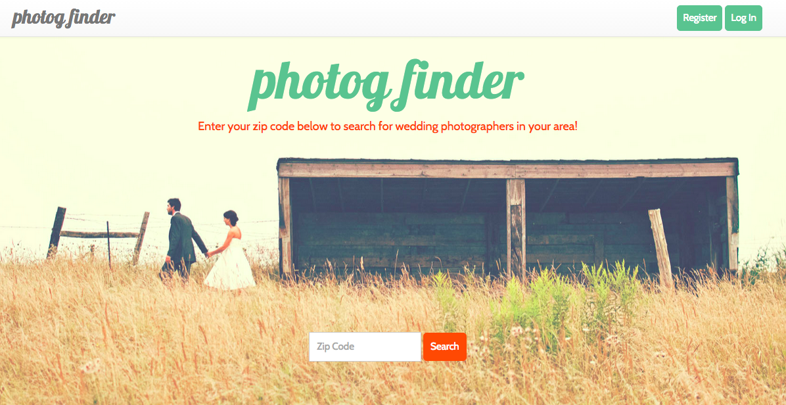

# Photog Finder

Photog Finder is an app that allows visitors to search for wedding photographers by zip code and view contact information and a selection of images for each photographer.  Photographers can log in, create and edit profiles, and upload and delete images.

Photog Finder uses Zip Code API to find the zip codes within a 20-mile radius of the zip code entered by the user/visitor and returns all of the photographers in the database that have one of the matching zip codes.

Note: This app is currently in development.  It's a work in progress!

Link to front end:

Repo: https://github.com/aemassa/project4-frontend

Link to back end:

Repo: https://github.com/aemassa/project4-backend

## Technologies Used

### Front End
- HTML
- CSS
- JavaScript
- jQuery
- AJAX
- Bootstrap
- Handlebars

### Back End
- Ruby
- Rails
- PostgreSQL

## Next Steps
- Break up functionality for new users vs. returning users vs. site visitiors.
- Continue to implement functionality for new users.
- Implement a modal carousel so that users and visitors can see larger images when they visit a photographer's profile.
- Include validations for login and profile info.
- Enable users to log out of the application.
- Refactor code
- Reach goals:
  - Allow non-photographer users to create accounts and send messages to photographers.
  - Allow visitors to specify a radius of 5 miles, 10 miles, etc. up to 50 miles.

